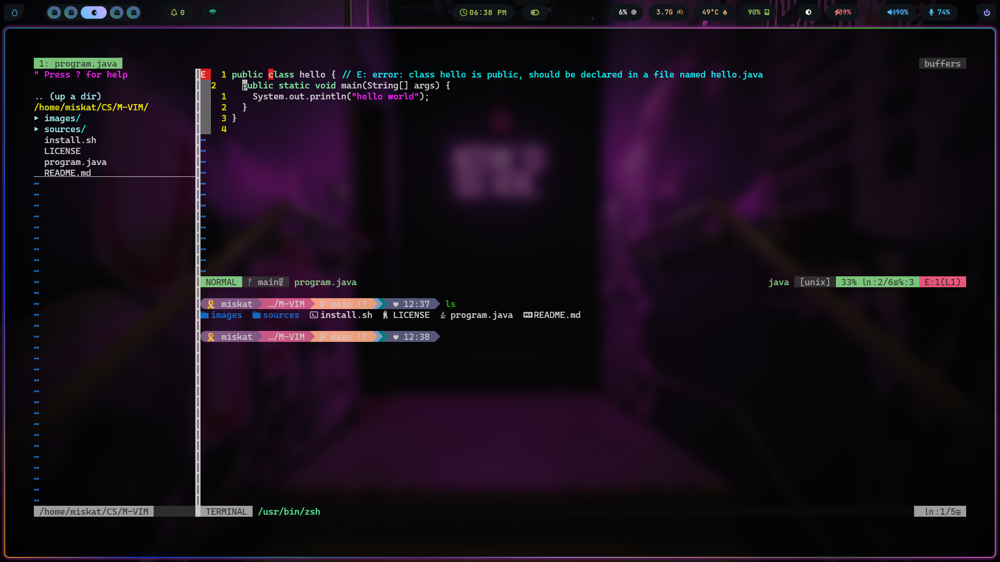

# M-VIM

A Config For VIM fans


## Installation 🚀

#### Vim

###### Unix

```sh
curl -fLo ~/.vim/autoload/plug.vim --create-dirs \
    https://raw.githubusercontent.com/junegunn/vim-plug/master/plug.vim
```

#### Plugins Setup 🤖



###### If you've already installed the vim-plug plugin manager, simply follow the procedure below

```bash
git clone https://github.com/miskatul-anwar/M-VIM.git
cd ./M-VIM
chmod +x ./.install.sh
./.install.sh
```

## Dependencies 💻

- git
- vim
- vim-plug
