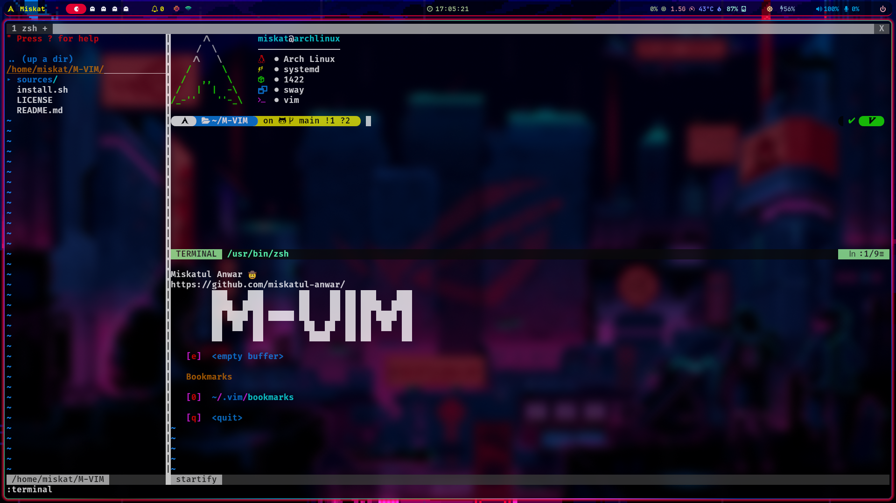

# M-VIM

A Config For VIM fans


## Installation 🚀

#### Vim

###### Unix

```sh
curl -fLo ~/.vim/autoload/plug.vim --create-dirs \
    https://raw.githubusercontent.com/junegunn/vim-plug/master/plug.vim
```

You can automate the process by putting the command in your Vim configuration
file as suggested [here][auto].

[auto]: https://github.com/junegunn/vim-plug/wiki/tips#automatic-installation

###### Windows (PowerShell)

```powershell
iwr -useb https://raw.githubusercontent.com/junegunn/vim-plug/master/plug.vim |`
    ni $HOME/vimfiles/autoload/plug.vim -Force
```

#### Neovim

###### Unix, Linux

```sh
sh -c 'curl -fLo "${XDG_DATA_HOME:-$HOME/.local/share}"/nvim/site/autoload/plug.vim --create-dirs \
       https://raw.githubusercontent.com/junegunn/vim-plug/master/plug.vim'
```

###### Linux (Flatpak)

```sh
curl -fLo ~/.var/app/io.neovim.nvim/data/nvim/site/autoload/plug.vim --create-dirs \
    https://raw.githubusercontent.com/junegunn/vim-plug/master/plug.vim
```

###### Windows (PowerShell)

```powershell
iwr -useb https://raw.githubusercontent.com/junegunn/vim-plug/master/plug.vim |`
    ni "$(@($env:XDG_DATA_HOME, $env:LOCALAPPDATA)[$null -eq $env:XDG_DATA_HOME])/nvim-data/site/autoload/plug.vim" -Force
```

### If you have already installed the vim-plug plugin, then you can simply run the following command to install M-VIM

```bash
git clone https://github.com/miskatul-anwar/M-VIM.git
chmod +x ./install.sh
./install.sh
```

## Dependencies 💻

- git
- vim
- vim-plug
